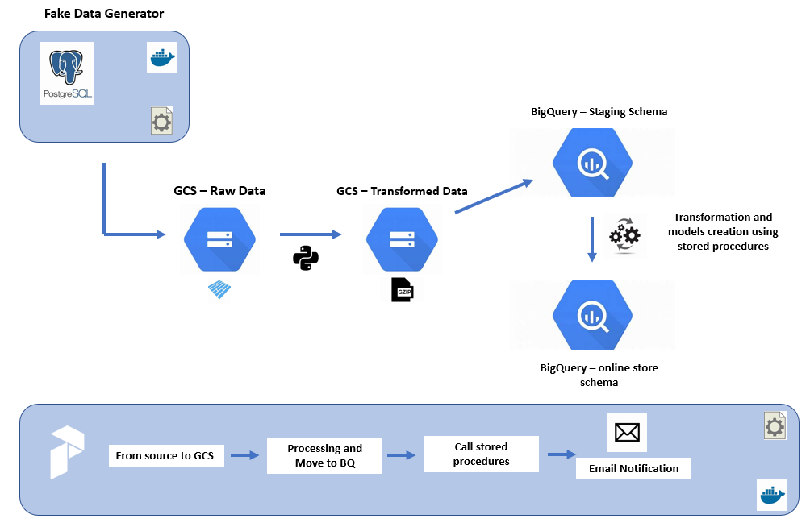

# Online Store Data Pipeline



## Description:

Fully Automated Pipeline to Manage the process of getting Raw Data from Source Systmes, Ingestig The Data to DataLake (Google Cloud Storage), Preparing the Data, Moving The Data to DataWarehouse (BigQuery), Transforming the Data to Create Aggregation Layers and RFM Analysis to Segment the Customers.

## Objective:

Transforming The raw transactional data that comes from postgres database on a daily basis to aggreagated layers and analytical layers that could be used to segment and analyse product success and targeting customers.

for more information about data source, check <a href="fake-data-generator/README.md">Data Source README</a>

for more information about final models and production tables Structure, check <a href="sql/README.md">final tables README</a>

## What Technologies are being Used?

- Cloud: [Google Cloud](https://cloud.google.com)
- Infrastructure: [Terraform](https://www.terraform.io/)
- Orchestration: [Prefect](https://www.prefect.io/)
- Data lake: [Google Cloud Storage](https://cloud.google.com/storage)
- Data warehouse: [BigQuery](https://cloud.google.com/bigquery)
- Data visualization: [Google Looker Studio](https://cloud.google.com/looker)

## Final Dashboard:

visit 

## How to Make it Work?

1. Setup your Google Cloud environment
- Create a [Google Cloud Platform project](https://console.cloud.google.com/cloud-resource-manager)
- Configure Identity and Access Management (IAM) for the service account, giving it the following privileges: BigQuery Admin, Storage Admin and Storage Object Admin
- Download the JSON credentials and save it, e.g. to `~/.gc/<credentials>`
- Install the [Google Cloud SDK](https://cloud.google.com/sdk/docs/install-sdk)
- Let the [environment variable point to your GCP key](https://cloud.google.com/docs/authentication/application-default-credentials#GAC), authenticate it and refresh the session token
```bash
export GOOGLE_APPLICATION_CREDENTIALS=<path_to_your_credentials>.json
gcloud auth activate-service-account --key-file $GOOGLE_APPLICATION_CREDENTIALS
gcloud auth application-default login
```
